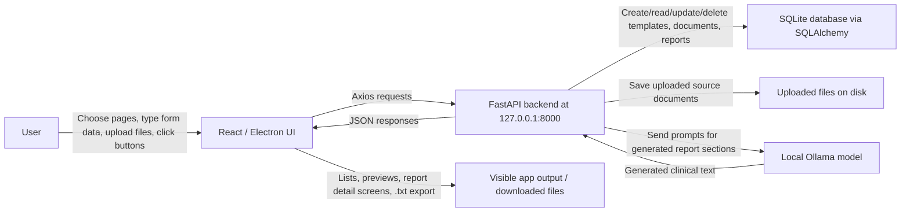
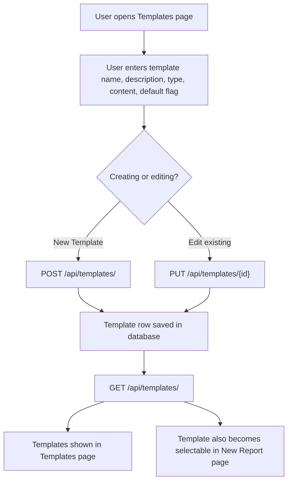
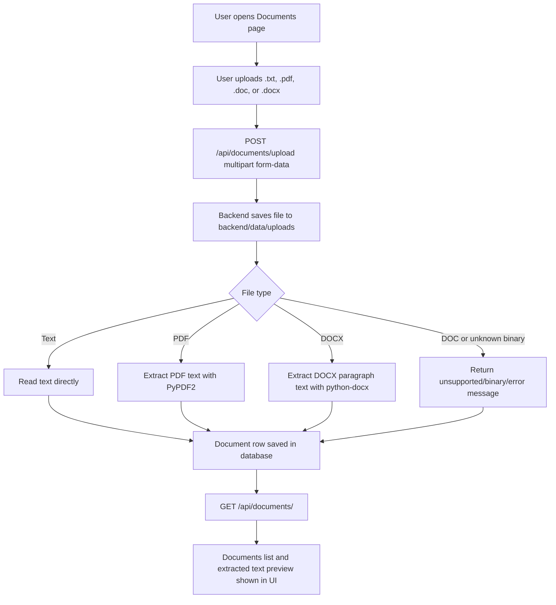
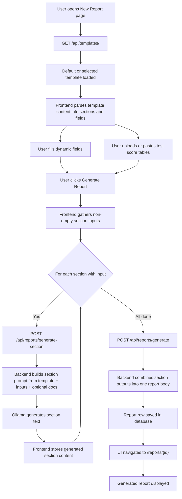
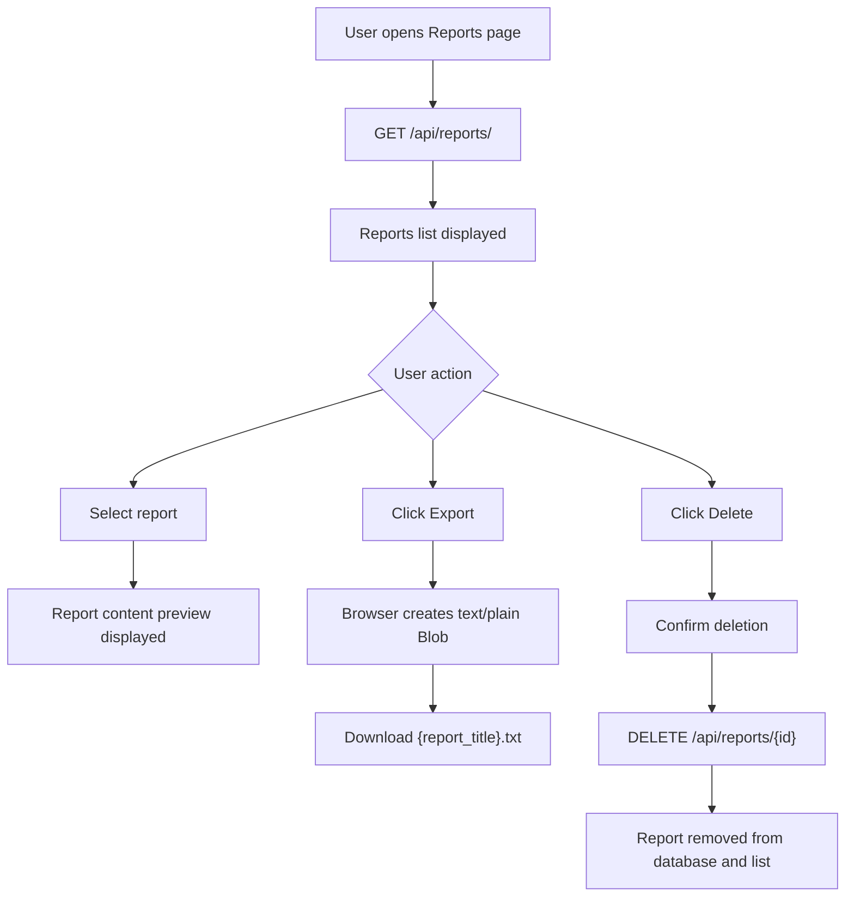
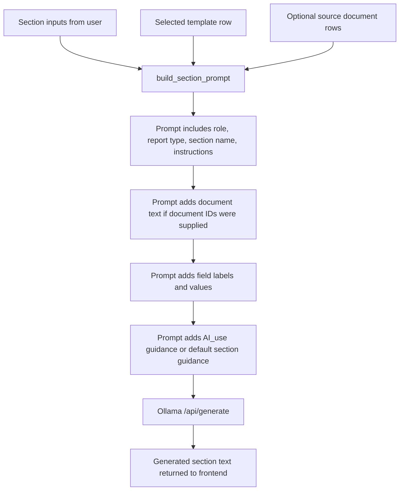

# Program Flowcharts: User Inputs and Outputs

These charts describe the current report generator as implemented in the live codebase.

## 1. Whole App Data Flow

## 2. Template Inputs and Outputs

User inputs:
- Template name
- Description
- Template type
- Template content or JSON section schema
- Default-template checkbox

Program outputs:
- Saved template records
- Template cards in the Templates page
- Dynamic form sections on the New Report page

## 3. Document Upload Inputs and Outputs

User inputs:
- Source document file
- Delete confirmation when removing a document

Program outputs:
- Stored uploaded file
- Extracted text content in the database
- Document list and preview
- Deletion result message

## 4. New Report Generation Inputs and Outputs

User inputs:
- Selected template
- Dynamic section field values
- Dates, text fields, text areas, selects, checkboxes, multi-selects, tables, and file names
- Test table type, custom test name, pasted table HTML/text, table description, uploaded table files

Program outputs:
- AI-generated text for each completed section
- Combined report content
- Saved report record with title, patient name, report type, and content
- Report detail screen

Current implementation note:
- The report save step currently combines generated section text into plain text/Markdown-style content.
- `patient_name` is currently hardcoded as `Patient Name` in the frontend submit flow.
- `document_ids` are currently sent as an empty list from the New Report page, even though the backend can include document text when IDs are provided.

## 5. Report Viewing, Export, and Delete Flow

User inputs:
- Report selection
- Export click
- Delete click and confirmation

Program outputs:
- Report preview
- Downloaded `.txt` file
- Updated reports list after deletion

## 6. AI Section Prompt Flow

Main input to the model:
- Template type
- Section name
- User-entered section fields
- Optional extracted document text
- Optional `AI_use:` guidance from the template content

Main output from the model:
- A single generated section body, without the section heading.
